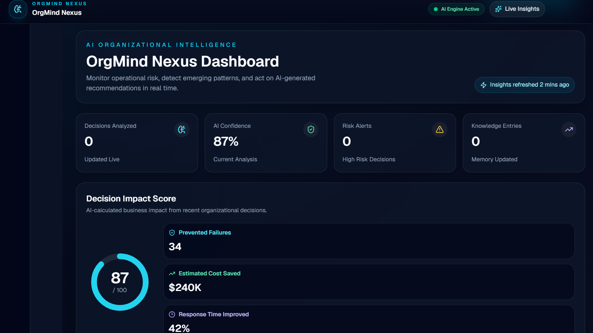
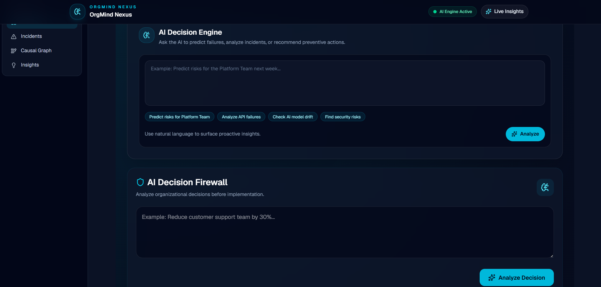
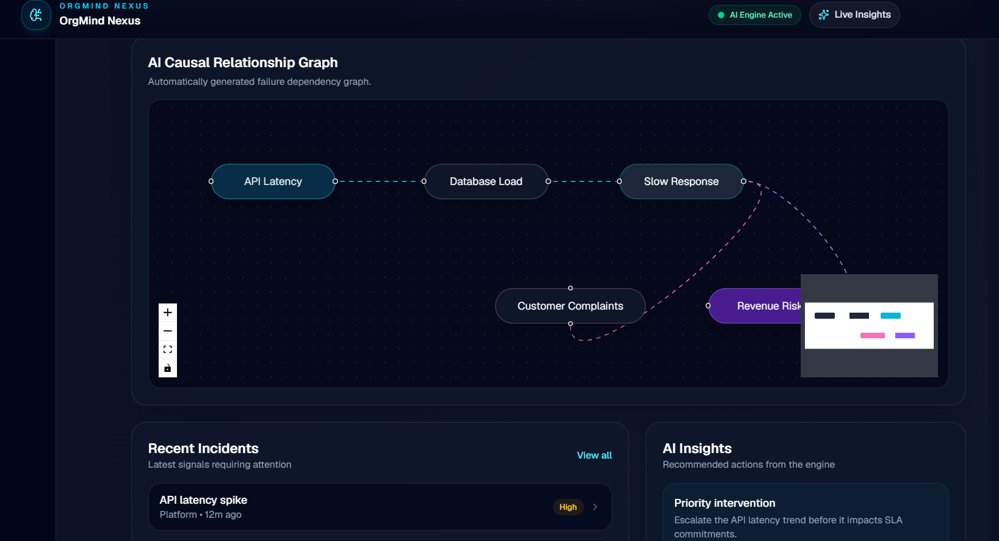
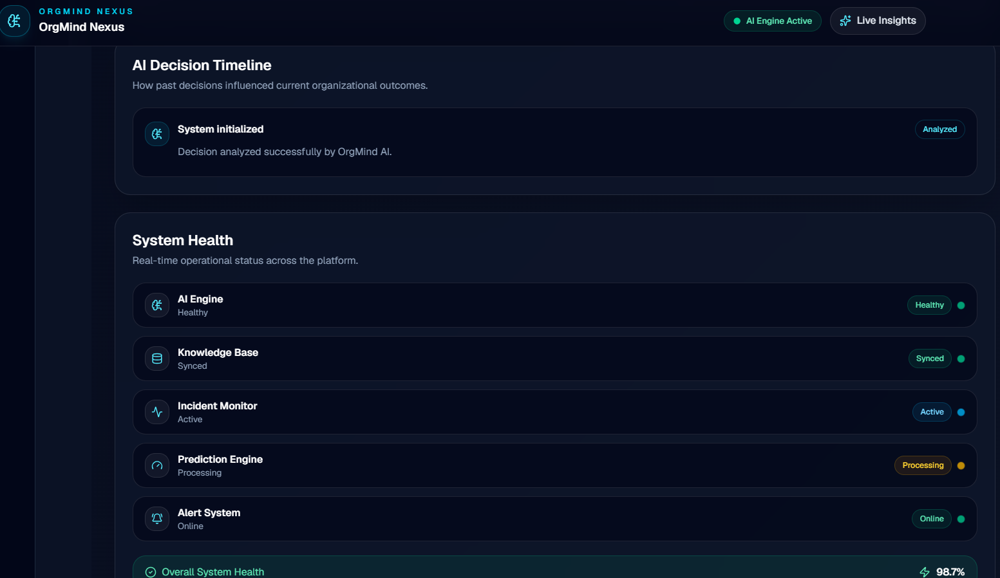
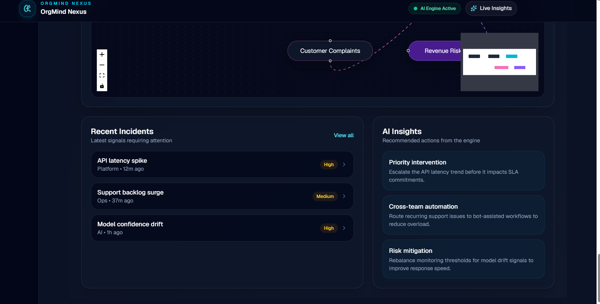
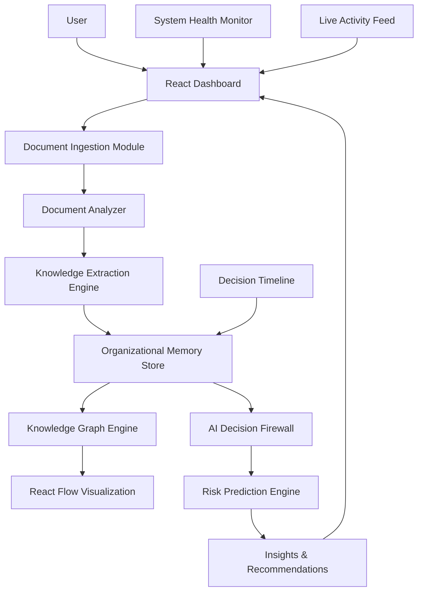

# 🧠 OrgMind Nexus

> **AI Organizational Memory & Failure Prevention Engine**

🚀 **Built by Team TRINITY BYTES**

---

## 📌 Problem Statement

Organizations repeatedly make similar mistakes because valuable knowledge is scattered across documents, meetings, incident reports, and employee memory. When employees leave or projects end, important lessons are lost, causing teams to repeat failures, waste time, and increase operational costs.

**OrgMind Nexus** addresses this challenge by preserving organizational knowledge and assisting teams in making informed, data-driven decisions before implementation.

---

# 💡 Our Solution

OrgMind Nexus is an AI-assisted decision support platform that helps organizations preserve knowledge and reduce repeated mistakes.

The platform brings together organizational information into a single dashboard where users can:

- Analyze important organizational decisions before implementation.
- Estimate potential risks and business impact.
- Maintain an organizational memory of previous analyses.
- Track decisions through an interactive timeline.
- Monitor organizational insights through a live dashboard.
- Export AI-generated decision reports for documentation.

Instead of replacing human decision-making, OrgMind Nexus assists teams by providing historical context and AI-generated recommendations before critical decisions are implemented.

---

# ✨ Features

### 🛡️ AI Decision Firewall
- Analyze organizational decisions before implementation
- AI-assisted risk assessment
- Risk score generation
- Confidence score
- Cost impact estimation
- Decision recommendation
- Final decision status
- Export analysis as a PDF report

---
## 📸 Screenshots

### 🧠 AI Organizational Memory Dashboard


### 📄 Document Knowledge Extraction


### 🛡️ AI Decision Firewall


### 🔗 Causal Failure Graph


### ⏳ Decision Timeline


### 📊 System Health Monitoring


### ⚡ Live Activity Feed


### 📈 AI Risk Prediction Trend


### 🚨 Recent Incidents & AI Insights

### 📄 Document Analyzer
- Upload organizational documents
- Display document insights
- Supports organizational knowledge management

---

### 📈 Decision Impact Score
Displays key decision metrics including:
- Decision Score
- Estimated Prevented Failures
- Estimated Cost Savings
- Response Improvement

---

### 📊 Risk Prediction Chart
Visualizes organizational trends including:
- Historical incidents
- Predicted risk
- Prevention score

---

### 🕒 Decision Timeline
- Tracks analyzed decisions
- Displays chronological updates

---

### 📡 Live Activity Feed
- Shows recent organizational activities
- Displays AI analysis updates

---

### 🔗 Causal Graph Preview
- Visual representation of relationships between organizational events and decisions

---

### 🎨 User Experience
- Modern Glassmorphism UI
- Responsive layout
- Smooth animations with Framer Motion
- Interactive dashboard


---

# 🛠️ Tech Stack

## Frontend

- React (Vite)
- React Router
- React Context API

## Styling & UI

- Tailwind CSS
- Framer Motion

## Data Visualization

- Recharts

## Icons

- Lucide React

## Utilities

- jsPDF
- react-hot-toast

## Version Control

- Git
- GitHub

## Deployment

- Vercel

## ✨ Key Features

### 🧠 AI Organizational Memory
- Converts scattered organizational knowledge into a structured memory system.
- Stores decisions, failures, incidents, and lessons learned.
- Helps teams avoid repeating past mistakes.

### 📄 Intelligent Document Analysis
- Upload project documents, reports, and post-mortems.
- Extracts important information and identifies hidden patterns.
- Converts unstructured data into actionable insights.

### 🕸️ Knowledge Graph Visualization
- Represents organizational knowledge as an interactive graph.
- Shows relationships between projects, decisions, failures, and causes.
- Helps users understand complex dependencies.

### 🛡️ AI Decision Firewall
- Analyzes new decisions before execution.
- Detects similarity with previous failures.
- Provides risk warnings and recommendations.

### 🔍 Failure Prediction Engine
- Identifies potential project risks using historical organizational data.
- Highlights possible failure points.
- Suggests preventive actions.

### 📅 Decision Timeline
- Tracks important organizational decisions chronologically.
- Maintains transparency and accountability.

### 📊 System Health Monitoring
- Displays organizational memory health.
- Shows risk trends and activity insights.

### ⚡ Live Activity Feed
- Provides real-time updates of system events.
- Tracks knowledge additions and AI-generated insights.

## 🏗️ System Architecture

OrgMind Nexus follows a modular AI-powered architecture that transforms scattered organizational information into actionable intelligence.



## 🔄 Project Workflow

The OrgMind Nexus workflow transforms raw organizational data into intelligent insights through multiple stages.

### 1. 📥 Data Collection
- Users upload organizational documents such as:
  - Project reports
  - Meeting notes
  - Incident reports
  - Post-mortems

### 2. 🧩 Knowledge Extraction
- The Document Analyzer processes uploaded information.
- Important entities are identified:
  - Projects
  - Decisions
  - Failures
  - Causes
  - Lessons learned

### 3. 🧠 Organizational Memory Creation
- Extracted knowledge is stored as structured organizational memory.
- Previous experiences become searchable and reusable.

### 4. 🕸️ Knowledge Graph Generation
- Relationships between events, decisions, and outcomes are visualized.
- Teams can discover hidden connections between past and present situations.

### 5. 🛡️ Decision Risk Analysis
- New decisions are analyzed against historical organizational knowledge.
- The AI Decision Firewall detects similar past failures.
- Risk warnings and recommendations are generated.

### 6. 📊 Insight Generation
- Users receive:
  - Risk predictions
  - Failure patterns
  - Decision impact scores
  - Preventive recommendations

### 7. 📈 Continuous Improvement
- Every new decision and outcome improves organizational intelligence over time.

## 🖥️ Demo Preview

### Dashboard Overview
The main dashboard provides a centralized view of organizational intelligence, including memory status, risks, insights, and activities.


---

### 🧠 AI Decision Firewall
Analyzes decisions and identifies possible risks using historical organizational knowledge.


---

### 🕸️ Knowledge Graph Visualization
Interactive visualization showing relationships between projects, decisions, failures, and causes.


---

### 📄 Document Analysis
Converts uploaded documents into structured organizational insights.


## ⚙️ Installation & Setup

Follow these steps to run OrgMind Nexus locally.

### 1. Clone the Repository

```bash
git clone https://github.com/TRINITY-BYTES/OrgMind-Nexus.git


```md
git clone https://github.com/TRINITY-BYTES/OrgMind-Nexus.git

## 🚀 Future Enhancements & Roadmap

OrgMind Nexus has the potential to evolve into a complete organizational intelligence platform.

### 🔹 Phase 1 — Advanced AI Intelligence
- Integration with Large Language Models (LLMs).
- Automated summarization of meetings and reports.
- More accurate failure pattern detection.
- Natural language querying of organizational memory.

### 🔹 Phase 2 — Enterprise Collaboration
- Multi-user workspace support.
- Role-based access control.
- Team collaboration features.
- Real-time knowledge sharing.

### 🔹 Phase 3 — Advanced Analytics
- Predictive project risk scoring.
- Organizational performance analytics.
- Decision success probability estimation.
- Automated recommendation systems.

### 🔹 Phase 4 — Scalable Deployment
- Cloud-based architecture.
- Secure database integration.
- Enterprise authentication.
- API-based integrations with existing tools.

---

## 🏆 Vision

To create an intelligent organizational memory system that helps teams learn from the past, make better decisions, and prevent repeated failures.

## 👥 Team — TRINITY BYTES

Built through collaborative effort across development, research, design, testing, and presentation.

| Member | Role |
|--------|------|
| Sristi Priya | Project Lead • Frontend Development • System Architecture • Integration & Documentation |
| Chandrima Chowdhury | Research & Analysis • Feature Planning • Testing • Documentation Support |
| Nandita Ghosh | UI/UX Design Support • User Experience Testing • Presentation & Demo Preparation |

---

## 🤝 Contribution

All team members contributed towards building, refining, and presenting OrgMind Nexus.

Team contributions include:

- Planning the solution approach and project workflow.
- Developing the web application and interactive dashboard.
- Designing user experience and improving interface quality.
- Researching organizational intelligence concepts.
- Testing features and refining system usability.
- Preparing documentation and hackathon presentation materials.

## 📜 License

This project is developed for hackathon purposes by Team TRINITY BYTES.

The source code is available for learning, experimentation, and further development.

## ⭐ Acknowledgement

We would like to thank the hackathon organizers and mentors for providing the opportunity to build innovative solutions using technology.

---

<div align="center">

### 🚀 Built with passion by TRINITY BYTES

**OrgMind Nexus**  
AI Organizational Memory & Failure Prevention Engine

</div>